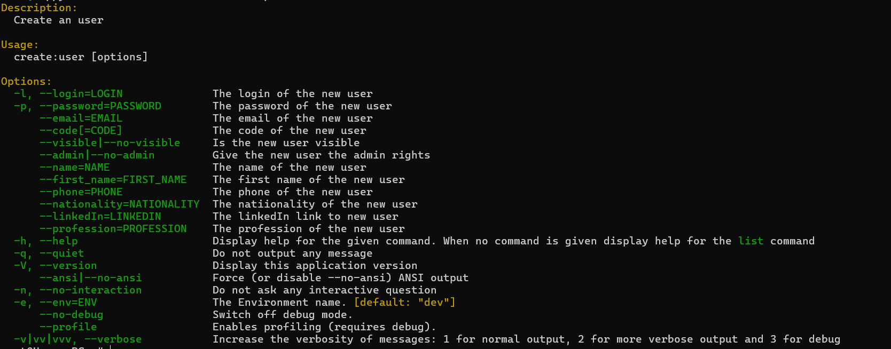

# Annuaire

## Lien du dépot Git

https://gitlabinfo.iutmontp.univ-montp2.fr/boissezonm/annuaire_web_project

## Utilisatton de l'application

### Les routes

- La route **/** permet d'accéder à la page principale du site, elle permet à l'utilisateur, connecté ou non, de voir la liste des utilisateurs inscrits qui sont visibles
- La route **/register** permet d'accéder aux formulaires d'inscription et de connexion
- La route **/profil/edition** permet d'accéder au formulaire d'édition pour modifier les informations à afficher de l'utilisateur connecté
- La route **/profil/utilisateur/{code}** permet de regarder les informations d'un utilisateur
- La route **/profil/utilisateur/{code}/json** permet de renvoyer les informations d'un utilisateur au format json

## Commande pour la création d'utilisateur

Pour créer un utilisateur dans le terminal, il faut rentrer la commande suivante : create:user

Comme le montre la commande **--help** de la commande, cette commande peut prendre différentes options pour paramétrer les différentes informations de base de l'utilisateur

- Login

L'option **--login** permet de renseigner le login de l'utilisateur à créer, ce login sera vérifier pour qu'il ne soit pas déjà pris par un utilisateur

- Email

L'option **--email** permet de renseigner le mail de l'utilisateur à créer, celui-ci est validé s'il l'addresse est valide et pas déjà utilisé par un autre utilisateur

- Mot de Passe

L'option **--password** permet de renseigner le mot de passe de l'utilisateur. En interactif, le mot de passe sera caché pour plus de sécurité

- Code

L'option **--code** permet de renseigner le code à utiliser pour créer l'utilisateur. Si le code n'est pas renseigné ou s'il est invalide, il sera de nouveau demandé de manière interactive. Si l'utilisateur ne renseigne rien à ce moment, le code sera alors généré aléatoirement

- Visibilité

L'option **--visible** et **--no-visible** permettent de définir si l'utilisateur sera visible ou caché depuis la liste des utilisateurs dans la page principale du site

- Role admin

l'option **--admin** ou **--no-admin** permet de déterminer si l'utilisateur à créer aura le rôle admin ou non. 

Les options concernant les informations de bases qui ne seront pas renseigné dans l'éxécution de la commande seront demandé de façon interactive pour que tous les champs soient renseignés. De même, les valeurs d'options qui ne seront pas valide seront à renseigner de nouveau.

En plus de ces options de bases, il y a aussi les options suivantes qui sont optionnels :
 
- Nom

L'option **--name** permet de renseigner le nom de l'utilisateur

- Prénom

L'option **--first_name** permet de renseigner le Prénom de l'utilisateur

- Numéro de téléphone

L'option **--phone** permet de renseigner le numéro de téléphone de l'utilisateur. Si cette valeur est rempli, il sera vérifié que le numéro soit au bon format

- Nationalité

L'option **--nationality** permet de renseigner la nationnalité de l'utilisateur

- Lien LikedIn

L'option **--linkedIn** permet de renseigner l'adresse linkedIn de l'utilisateur

- Profession

L'option **--profession** permet de renseigner la profession de l'utilisateur

## Investissement du groupe

- Clément H. : Informations d'un utilisateur en JSON, Vue du profil d'un utilisateur, JavaScript
- Maëlys BOISSEZON : Connexion, deconnexion, liste des utilisateurs, édition de profil, CSS, dates d'édition et de connexion, classe Utilisateur 
- Romain T. : Suppression Profil, Mode maintenance, Inscription, Commande Symfony, Role Admin, Initialisation du projet

## Indications supplémentaires

### Mode Maintenance

Concernant le mode maintenance, pour l'activer il faut se rendre dans le fichier config/services.yaml. Il faut ensuite modifier la valeur du paramétre maintenance_mode pour le mettre à true. Pour le désactiver, il faut passer ce paramètre à false
